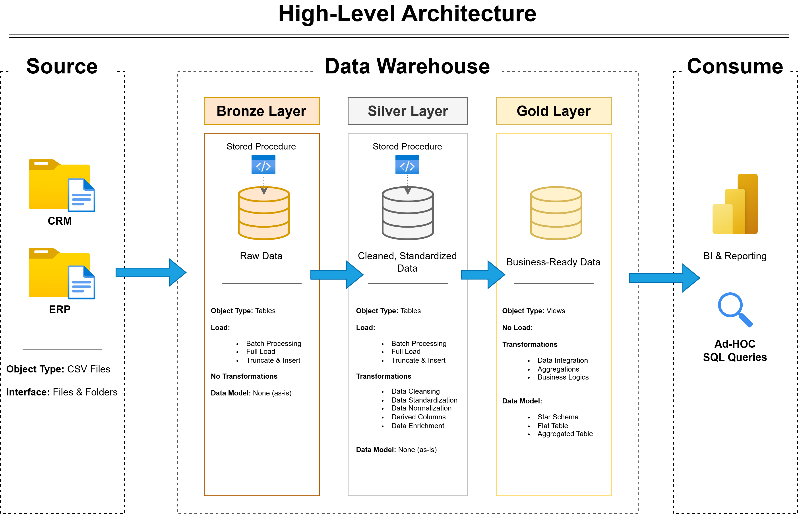

# Data Warehouse and Analytics Project

Welcome to the **Data Warehouse and Analytics Project** repository! 🚀  
This project showcases the full lifecycle of building a modern data warehouse and delivering actionable business insights. Designed as a portfolio project, it demonstrates data engineering best practices with a focus on ETL pipelines, data modeling, and reporting.

---

## 🏗️ Data Architecture

This project follows the **Medallion Architecture** using three layers:

- **Bronze Layer**: Raw data ingested from CSV files into a SQL Server database.
- **Silver Layer**: Cleaned and standardized data.
- **Gold Layer**: Star-schema modeled data ready for analysis and reporting.

---

## 📖 Project Overview

This project includes:

- 🏛️ **Data Architecture Design** with Bronze, Silver, and Gold layers.
- 🔄 **ETL Pipelines** to extract, transform, and load data.
- 🧠 **Data Modeling** using fact and dimension tables.

---

### 🧱 Data Engineering

**Goal**: Build a modern postgreSQL data warehouse to consolidate and analyze sales data.

- **Data Sources**: ERP and CRM data in CSV format.
- **Integration**: Merge sources into a single analytical model.
- **Data Quality**: Clean and resolve issues before loading.
- **Documentation**: Maintain clear data model docs for business and tech users.

---

## 🧾 License

This project is licensed under the [MIT License](LICENSE).  
Feel free to use, modify, and share this project with proper attribution.

---

## 🙋 About the Author

Hi! I'm **Deepankar Singh**, a data enthusiast and aspiring data engineer.  
This project is part of my personal portfolio to demonstrate hands-on skills in modern data warehousing, and ETL development.

📫 Let's connect:
- [LinkedIn](www.linkedin.com/in/deepankar-singh-a35b14296)
- [GitHub](https://github.com/CodewithDeep23)

---

If you found this project helpful, feel free to ⭐ the repo!